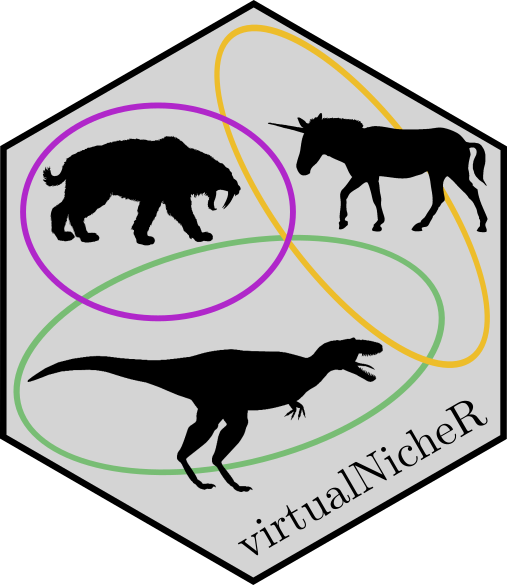

---
output:
  html_document:
    self_contained: no
---

<!-- README.md is generated from README.Rmd. Please edit that file -->

```{r setup, include = FALSE}
knitr::opts_chunk$set(
  collapse = TRUE,
  comment = "#>",
  fig.path = "man/figures/README-",
  out.width = "100%"
)
```
[](https://doi.org/10.21105/joss.01661)

# virtualNicheR 

To evaluate how well species-environment models perform in different situations, modellers need the ability to generate virtual niches that have known properties.  These virtual niches can then form the basis of virtual ecology experiments that can test how well different models perform under different conditions.

`virtualNicheR` is an `R` package that is unique in that it provides an integrated framework that is needed to generate both [fundamental and realised niches](https://en.wikipedia.org/wiki/Ecological_niche).  We envisage that the ability to generate integrated fundamental and realised virtual niches will allow modellers to improve the virtual ecology experiments that have been advocated for evaluating species-environment relationship models.

The fundamental niches are defined as [multivariate normal distributions](https://en.wikipedia.org/wiki/Multivariate_normal_distribution), and the realised niches are created by defining the positive and negative interactions amongst a community of fundamental niches.  A full description of the `virtualNicheR` package, including connections to niche theory and an explanation of the underlying mathematics, can be found in the associated [software paper](https://joss.theoj.org/papers/10.21105/joss.01661).

## Citation

If you use `virtualNicheR` in your research we would be very grateful if you could please cite the software using the following software paper:

[Etherington TR, Omondiagbe OP (2019) virtualNicheR: generating virtual fundamental and realised niches for use in virtual ecology experiments. Journal of Open Source Software 4:1661](https://joss.theoj.org/papers/10.21105/joss.01661)

## Community guidelines

We very much welcome input from others!  If you find a bug, need some help, or can think of some extra functionality that would be useful, please raise an [issue](https://github.com/manaakiwhenua/virtualNicheR/issues).  Better still, please feel free to fork the project and raise a pull request if you think and can fix a bug, clarify the documentation, or improve the functionality yourself.

## Installation

You can install `virtualNicheR` from GitHub with:

``` r
# install.packages("githubinstall")
githubinstall::githubinstall("manaakiwhenua/virtualNicheR")

# install.packages("devtools")
devtools::install_github("manaakiwhenua/virtualNicheR")
```

## Dependencies

`virtualNicheR` is not dependant on any additional packages, and was developed using `R` version 3.5.1.

## Quick Examples

In ``virtualNicheR`` the **fundamental niche** of a virtual species *S* is defined by:

-  λ<sub>*max*</sub>, the species' maximum finite rate of increase at the fundamental niche optimum,
- **μ**, a vector of means  that gives the optimum location of the niche in each dimension, and
- **Σ**, a variance-covariance matrix  that gives the size and orientation of the niche in each dimension.

By generating a systematic grid of coordinates in niche space, the niche can be easily visualised.

``` {r fund-niche-example}
library(virtualNicheR)

# Create coordinates across niche space
niche.XY = niche.grid.coords(mins=c(15,0), maxs=c(35,200), nCoords=121)

# Define a species as a function of the maximum finite rate of increase,
# a means vector, and covariance matrix
lambdaMax = 2.5
meansVector = matrix(c(25, 100))
covarMatrix = matrix(data=c(9, 60,
                            60, 625), nrow=2, ncol=2, byrow = TRUE)
species = list(lambdaMax, meansVector, covarMatrix)

# Calculate the fundamental niche
fundNiche = fund.niche(niche.XY, species)

# Plot the fundamental niche
fundNicheMatrix = matrix(fundNiche, nrow=length(unique(niche.XY[,1])))
nContour = 10
filled.contour(unique(niche.XY[,1]), unique(niche.XY[,2]), fundNicheMatrix,
               levels = seq(0, lambdaMax, lambdaMax/nContour),
               col=colorRampPalette(c("gold", "firebrick"))(nContour),
               xlab=expression(paste("Temperature (", degree, "C)")),
               ylab="Rainfall (mm)",
               main ="Fundamental niche",
               key.title = title(main = expression(lambda)))

```

Given maps of environmental data, the fundamental niche can also be mapped in geographic space to create a **potential niche**.

``` {r pote-niche-example}
# Map the potential niche given maps of environmental variables
# Convert matrices of variables into columns
temp1D = matrix(temperatureMap, ncol=1)
rain1D = matrix(rainfallMap, ncol=1)
data.XY = cbind(temp1D, rain1D)
# Calculate the potential niche and form back in a 2D map
poteNiche = fund.niche(data.XY, species)
poteNiche2D = matrix(poteNiche, ncol=100)
filled.contour(z=poteNiche2D,
              levels = seq(0, lambdaMax, lambdaMax/nContour),
              col=colorRampPalette(c("gold", "firebrick"))(nContour),
              asp=1, plot.axes = {}, frame.plot=FALSE,
              main ="Map of the potential niche",
              key.title = title(main = expression(lambda)))

```

Having created fundamental niches for several species, by defining a matrix that quantifies the interactions (competition, predation, commensalism, amensalism, or mutualism) between species, it is also possible to calculate a **realised niche**  that accounts for positive and negative affects of species interactions.

``` {r real-niche-example}
# Define the community
species1 = list(2.5, matrix(c(25, 100)), matrix(data=c(9, 60,
                                                       60, 625), nrow=2, ncol=2, byrow=TRUE))
species2 = list(5.0, matrix(c(28, 110)), matrix(data=c(4, -20, 
                                                      -20, 500), nrow=2, ncol=2, byrow=TRUE))
species3 = list(3.0, matrix(c(25, 80)), matrix(data=c(4, 0,
                                                      0, 150), nrow=2, ncol=2, byrow=TRUE))
community = list(species1, species2, species3)

# Define the interactions
interactions = matrix(data=c(0.0, 0.2,-0.4,
                            -1.0, 0.0,-1.0,
                            -0.6, 0.3, 0.0), nrow=3, ncol=3,byrow = TRUE)

# Calculate the realised niche values
niche.XY = niche.grid.coords(mins=c(15,0), maxs=c(35,200), nCoords=121)
realNiche = real.niche(niche.XY, community, interactions)

# Plot the realised niche for species 1
realNiche1 = matrix(realNiche[,1], nrow=length(unique(niche.XY[,1])))
nContour = 10
filled.contour(unique(niche.XY[,1]), unique(niche.XY[,2]), realNiche1,
               levels = seq(0, 5, 5/nContour),
               col=colorRampPalette(c("gold", "firebrick"))(nContour),
               xlab=expression(paste("Temperature (", degree, "C)")),
               ylab="Rainfall (mm)",
               main ="Realised niche",
               key.title = title(main = expression(lambda)))

```
