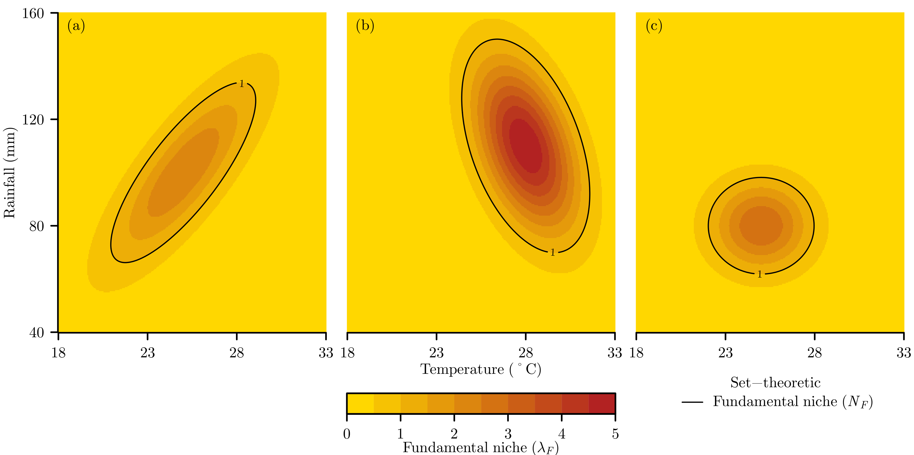
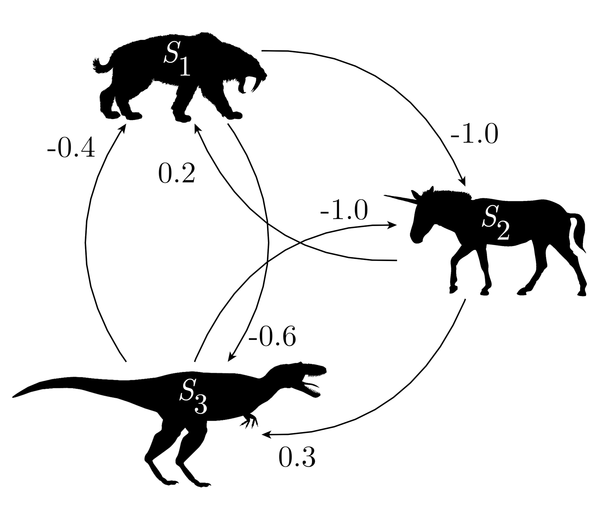

# Introduction

Models of species-environment relationships (such as: habitat suitability models, species distribution models, resource selection functions, or ecological niche models) are an important part of ecological science.  The foundation of many of these models is the concept of fundamental and realised ecological niches that delineate the combinations of abiotic and biotic conditions under which a species can persist indefinitely [@hutchinson-1957].

The ``virtualNicheR`` software we have developed creates virtual fundamental and realised niches for virtual, or imaginary, species.  The ability to generate virtual niches enables the virtual ecology experiments [@zurell-2010] that have been advocated for evaluating species-environment relationship models [@miller-2014].  There are a variety of existing software tools that aim to do this [@duan-2015; @leroy-2016; @qiao-2016], but none of the existing software differentiate between fundamental and realised niches, which is important given differences in possible complexity of shape [@blonder-2016].  The ``virtualNicheR`` software that we have developed is therefore unique in that it provides an integrated framework within which to generate both fundamental and realised niches.

# Virtual niche framework -- from sets to continuums

@hutchinson-1957 introduced the concept of fundamental $N_{F}$ and realised $N_{R}$ ecological niches using set theory terminology.  Given $n$ environmental variables an $n$-dimensional hypervolume can be defined within which conditions would allow a species to exist indefinitely.  If $A$ is the set of abiotic conditions (moisture, temperature, etc) required, then $N_{F} = A$, and if $B$ is the set of biotic conditions (presence of: prey, hosts, mutualists, etc; and absence of: competitors, predators, diseases, etc) required, then the realised niche is the intersection of the set of abiotic and biotic conditions, $N_{R} = A \cap B$, and therefore the realised niche is a subset of the fundamental niche, $N_{R} \subseteq N_{F}$ [@soberon-2005].

However, @hutchinson-1957 immediately recognised the limitations of expressing niches from set-theoretic perspective, as niches will ordinarily occur along a gradient of optimal to suboptimal conditions, but with set theory you are either inside or outside of the niche.  In addition, as $N_{R} \subseteq N_{F}$, a set-theoretic perspective of the realised niche only works when fundamental niches are reduced in size through interspecific species competition, which is how Hutchinson [-@hutchinson-1957] first described the realised niche.  But interspecific species interactions may not just be a the pair-wise negative interaction of species competition ($--$), as there are other interactions that include positive or asymmetrical interactions: predator-prey or parasite-host ($+-$), commensalism ($+0$), amensalism ($-0$), or mutualism ($++$), though some of these have received almost no attention in niche theory [@chase-2003].  Recognising that an important host, prey, or mutualist could result in a realised niche larger than a fundamental niche the ``virtualNicheR`` software does not use the traditional set-theoretic framework.

An alternative niche framework was presented by @maguire-1973 who extended the niche to a continuous model based on population growth rates, which @hutchinson-1978 himself considered to be a "considerable extension to the multidimensional niche".  Representing niches as a continuum using a species population's finite rate of increase $\lambda$, where $\lambda \geq 1$ results in a species existing indefinitely, has supported more recent modelling that has developed niche theory [@pulliam-2000] and as such is how we choose to model niches in ``virtualNicheR``.

# Fundamental niches

The niche modelling of ``virtualNicheR`` follows a similar approach to that of Gauch and Whittaker [-@gauch-1972] who based their virtual species on normal distributions, and as such that a fundamental niche is unimodal and convex.  However, we have extended this principle to use multivariate normal distributions such that $n$-dimensional niches can be defined.

In ``virtualNicheR`` the starting point for computing virtual niches is an $m \times n$ matrix

$$
\begin{bmatrix}
    x_{1,1} & x_{1,2} & x_{1,3} & \dots  & x_{1,n} \\
    x_{2,1} & x_{2,2} & x_{2,3} & \dots  & x_{2,n} \\
    x_{3,1} & x_{3,2} & x_{3,3} & \dots  & x_{2,n} \\
    \vdots & \vdots & \vdots & \ddots & \vdots \\
    x_{m,1} & x_{m,2} & x_{m,3} & \dots  & x_{m,n}
\end{bmatrix}
$$

that defines $m$ niche coordinates in $n$ dimensions of environmental space for which virtual niche values are required.

The fundamental niche of a virtual species is defined by three parameters:

- $\lambda_{\textrm{max}}$, the species' maximum finite rate of increase at the fundamental niche optimum,
- $\boldsymbol\mu$, a $n \times 1$ column vector of means that gives the optimum location of the niche in each dimension, and
- $\boldsymbol\Sigma$, a $n \times n$ variance-covariance matrix that gives the size and orientation of the niche in each dimension.

In ``virtualNicheR`` a virtual species is represented as a set of these variables, so $S = \{ \lambda_{\textrm{max}}, \boldsymbol\mu, \boldsymbol\Sigma \}$.

For a coordinate column vector $\textbf{x}_m = [x_{m,1}, x_{m,2}, x_{m,3}, \dots, x_{m,n}]^{\textrm{T}}$, the fundamental niche finite rate of increase $\lambda_{F(\mathbf{x})}$ of a virtual species for that coordinate is then calculated as:

$$\lambda_{F(\mathbf{x}_m)} = \lambda_{\textrm{max}} \times e^{-  \frac{1}{2} (\mathbf{x}_m - \boldsymbol\mu)^{\textrm{T}} \boldsymbol\Sigma^{-1} (\mathbf{x}_m - \boldsymbol\mu)}$$

To illustrate how the defining parameters interact to create $\lambda_{F(\mathbf{x})}$, consider three virtual species defined as:

$$
S_{1} = \begin{Bmatrix}
2.5,
\begin{bmatrix} 
25 \\
100 \\
\end{bmatrix}
,
\begin{bmatrix}
9 & 60 \\
60 & 625 \\
\end{bmatrix}
\end{Bmatrix}
$$

$$
S_{2} = \begin{Bmatrix}
5.0,
\begin{bmatrix} 
28 \\
110 \\
\end{bmatrix}
,
\begin{bmatrix} 
4 & -20 \\
-20 & 500 \\
\end{bmatrix}
\end{Bmatrix}
$$

$$
S_{3} = \begin{Bmatrix}
3.0,
\begin{bmatrix} 
25 \\
80 \\
\end{bmatrix}
,
\begin{bmatrix} 
4 & 0 \\
0 & 150 \\
\end{bmatrix}
\end{Bmatrix}
$$

When the $\lambda_{F}$ values for a systematic grid of coordinates across environmental space are visualised it becomes clear that each of these virtual species fundamental niche occupies a slightly different part of niche space, with $\lambda_{F}$ varying by location, size, orientation, and magnitude (Figure 1).

# Realised niches

While the fundamental niche is essentially static for a species, only changing through evolution, the realised niche is a dynamic realisation of niche space as it will fluctuate with changes in species populations which in some systems will be cyclical or even chaotic.  Therefore, we model realised niches as viewed as a static point in time, and do so by defining a square matrix $\mathbf{I}$ that quantifies the pair-wise interspecific species interactions in the virtual community as if all interacting $+$ and $-$ interactions have been balanced out.  The diagonal of the matrix is zero, so species do not affect themselves, and the remainder of the matrix has values that represent positive and negative effects, where $\mathbf{I}_{ij}$ is the effect of species $j$ on species $i$.  For example, the interactions matrix

$$
\mathbf{I} =
\begin{bmatrix} 
 0.0 & 0.2 & -0.4 \\
-1.0 & 0.0 & -1.0 \\
-0.6 & 0.3 &  0.0 \\
\end{bmatrix}
$$

represents a community of three species in which: $\mathbf{I}_{1,2} = 0.2$ and $\mathbf{I}_{2,1} = -1.0$ so $S_{1}$ is a predator of $S_{2}$, $\mathbf{I}_{1,3} = -0.4$ and $\mathbf{I}_{3,1} = -0.6$ so $S_{1}$ and $S_{3}$ are competitors, and $\mathbf{I}_{2,3} = -1.0$ and $\mathbf{I}_{3,2} = 0.3$ so $S_{3}$ is also a predator of $S_{2}$ (Figure 2).

Given a vector $\mathbf{f}_{(\mathbf{x})}$ of fundamental niche values $\lambda_{F}$ for $n$ species in a community, so $\mathbf{f}_{(\mathbf{x})} = [\lambda_{F1(\mathbf{x})}, \lambda_{F2(\mathbf{x})}, \dots, \lambda_{Fn(\mathbf{x})}]$, then a vector of realised niches $\mathbf{r}_{(\mathbf{x})} = [\lambda_{R1(\mathbf{x})}, \lambda_{R2(\mathbf{x})}, \dots, \lambda_{Rn(\mathbf{x})}]$ can be calculated as:

$$
\mathbf{r}_{(\mathbf{x})} = \mathbf{f}_{(\mathbf{x})} \circ e^{\mathbf{f}_{(\mathbf{x})} \mathbf{I}^{\textrm{T}}}
$$

Returning to our three example virtual species, we begin by creating a community $C$ of species that is represented in ``virtualNicheR`` as a set of species, so $C = \{ S_{1}, S_{2}, S_{3} \}$.  Then we can use $\mathbf{I}$ to calculate the realised niches of this community (Figure 3).

We can see that the realised niches can take very complex shapes that have varying degrees of difference from the fundamental niches.  $S_{1}$ has a realised niche that is both skewed and concave and results from the negative affect from $S_{3}$ and the positive affect of $S_{2}$ that expands the realised niche beyond fundamental niche (Figure 3a).  $S_{2}$ has a realised niche that is bimodal and an overall reduction from the fundamental niche due to the negative effects of $S_{1}$ and $S_{3}$ (Figure 3b).  $S_{3}$ has the simplest shaped realised niche that is still somewhat normally distributed, but with the negative effects of $S_{1}$ and the positive effects of $S_{2}$ having shifted and elongated the realised niche relative to the fundamental niche.

# From environmental to geographic space

While ``virtualNicheR`` fundamental and realised niches are defined in environmental space, it is quite straightforward to use ``virtualNicheR`` to map out niches in geographic space.  This can be useful as not all environmental conditions within a niche may exist in geographic space at a given time, leading to a potential niche ($\lambda_{P}$) that is always smaller than a fundamental niche [@jackson-2000].  Mapping niches could either be done using neutral landscape models [@etherington-2015; @sciaini-2018] to create virtual geographic data (Figure 4) or for real geographic data depending on a user's need.

# Availability

``virtualNicheR`` is open source software made available under the MIT license. Installation instructions can be found at the GitHub repository [https://github.com/manaakiwhenua/virtualNicheR](https://github.com/manaakiwhenua/virtualNicheR).

# Acknowledgements

This research was funded by internal investment by Manaaki Whenua –- Landcare Research.

# References
